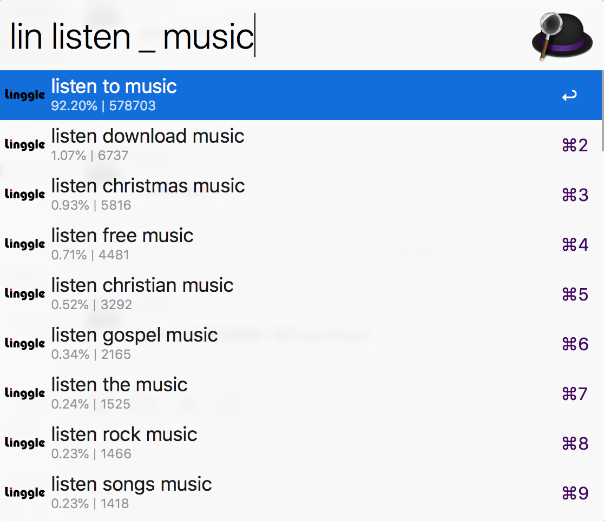
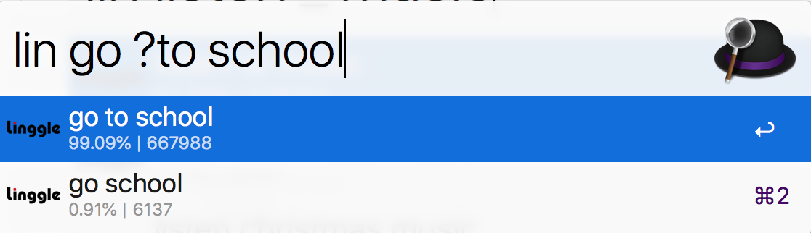

# Linggle for Alfred

An Alfred 3 workflow for seaching collocations in [Linggle](https://linggle.com)!

## Requirements

- Alfred >= 3.8

## Quick Start

- Toggle by `lin <query>`.
- Press `RETURN` to copy the results.

## Snapshots

